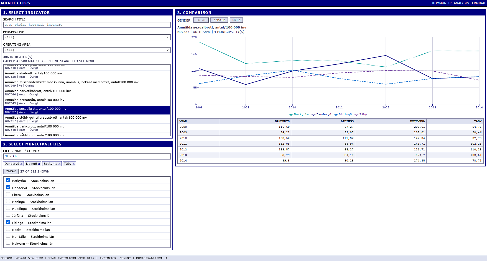

# Munilytics

A data warehouse and analysis frontend for Swedish municipal KPIs, sourced from the
[Kolada](https://www.kolada.se/) open API. Municipal officials can search indicators
and compare them across municipalities and over time.



## Stack

| Piece | What it is |
|---|---|
| **Munilytics.AppHost** | .NET Aspire orchestrator |
| **Munilytics.Server** | ASP.NET Core (.NET 10), FastEndpoints, Wolverine, EF Core |
| **Munilytics.MigrationService** | Worker that applies EF migrations on startup |
| **Munilytics.Cube** | Cube semantic layer: the read/analytics API the frontend queries |
| **frontend** | Vite + React 19 |
| Postgres (Hydra) | Star-schema warehouse |
| Redis | Cube cache |

The frontend talks to **Cube**, not to the server. The server's only job today is
ingesting Kolada data into the warehouse.

## Running it

Prerequisites: [.NET 10 SDK](https://dotnet.microsoft.com/download), the
[Aspire CLI](https://aspire.dev), Docker Desktop, and Node 20+.

```bash
aspire run
```

That starts Postgres, Redis, Cube, the migration service, the API, and the frontend,
and prints a dashboard URL with links to each. Changes to `AppHost.cs` require a restart.

First run takes a while: the scheduler begins pulling from Kolada immediately, and a
full fact-table load is several million rows.

## Data model

Star schema in `public`:

- `Fact_KpiMeasurements` — one row per (KPI, municipality, year, gender)
- `Dim_KPIs`, `Dim_Municipalities`, `Dim_Time`, `Dim_Gender`

`Status` on a fact row is `''` for reported data, or `Missing` / `Privacy` for
placeholders. Only `''` rows are real values — the `KpiMeasurements.reportedOnly`
segment in Cube filters to these, and anything reading the fact table directly
should do the same.

Gender codes are `T` (total), `K` (female), `M` (male). Most indicators only carry `T`.

## Ingestion

`KoladaSyncAgent` runs as a Wolverine singleton agent, waking every 5 minutes. It
re-runs each job whose last success is older than 7 days, and walks the fact sync
forward one year at a time from the newest year present up to the current year.
Job state lives in `SystemSettings`, with stale-lock recovery so a crashed run
doesn't wedge the schedule permanently.

To trigger a sync by hand:

```bash
curl -X POST http://localhost:<server-port>/admin/sync/kpis
```

Also `/admin/sync/municipalities` and `/admin/sync/facts`. All three are
`AllowAnonymous` and return immediately — the work is queued to a background
handler, so watch the logs, not the response. Swagger is served in development.

## Cube

Model files live in `Munilytics.Cube/model/` and are bind-mounted into the container
at `/cube/conf`. Cube picks up edits live — no restart needed. Only the `model/`
directory is read; files anywhere else are silently ignored.

## Frontend

Reads `VITE_CUBE_URL`, injected by AppHost. Running `npm run dev` outside Aspire
needs that set manually, or it falls back to `http://localhost:4000`.

